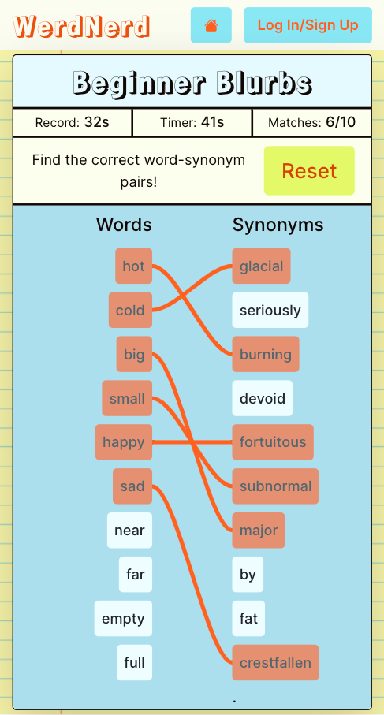
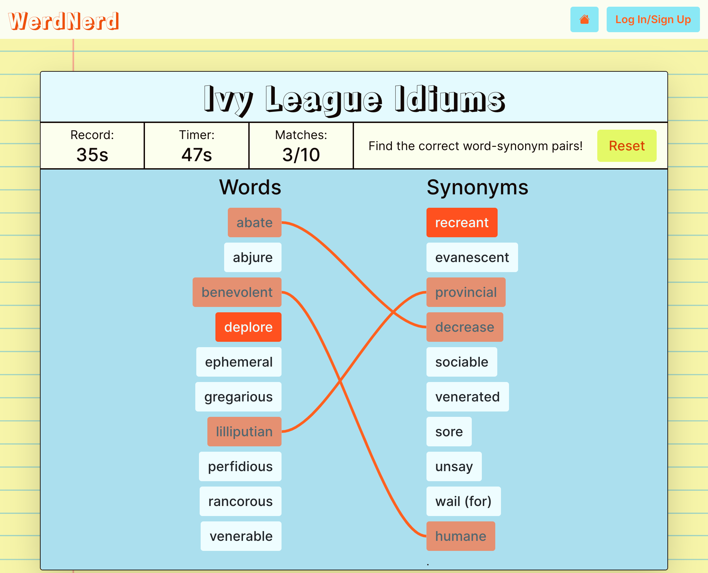

# WerdNerd

See the [deployed app](https://werd-nerd.herokuapp.com/)

[Link](https://github.com/BluejayTay/word_app_react) to React frontend/client

#

## About

WerdNerd is an app that uses Merriam-Webster&apos;s Collegiate® Thesaurus API to create word-matching games for developing one’s vocabulary. Users can utilize pre-assembled word-lists for their games, or create their own if they are logged-in. Each game pulls randomly-selected synonyms for each word in it&apos;s word-list, so that every game with a given word-list is different!

Built with:

- Ruby on Rails
- React.js
- JWT authorization
- PostgreSQL
- HTML, CSS, BootStrap
- Merriam-Webster&apos;s Collegiate® Thesaurus API
- Deployed with Heroku

#

## Screenshot-Mobile

## Screenshot-Desktop

#

## Future Enhancements

- Add a "study" feature to allow users to study definitiions for words in their word-lists.
- Add feature that lets suggests similarly spelled words if a given word is not in the thesaurus or is misspelled.
- Add ability to post initials for highscores for the orginal WerdNerd word-lists.